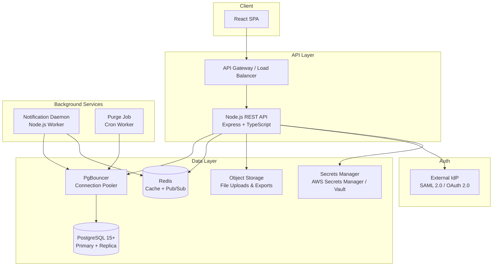
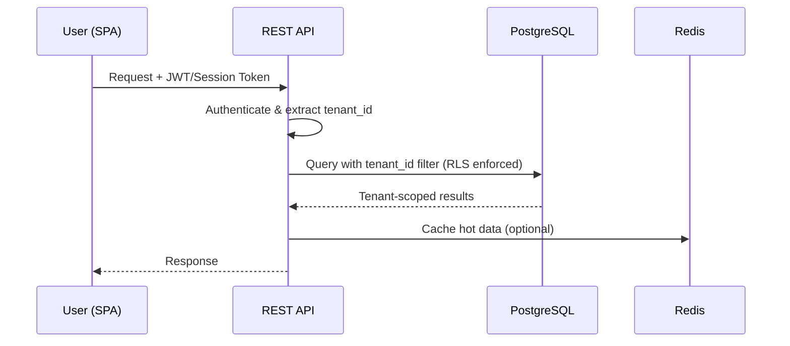
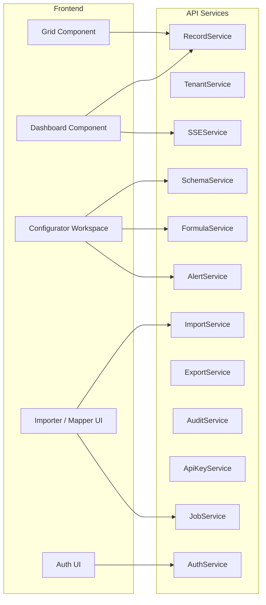
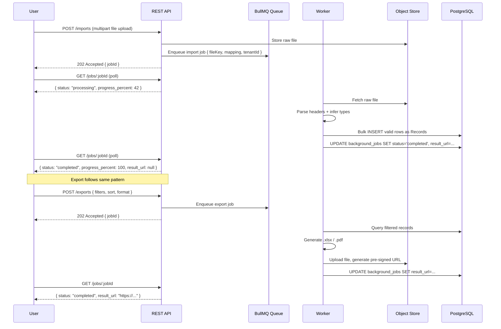
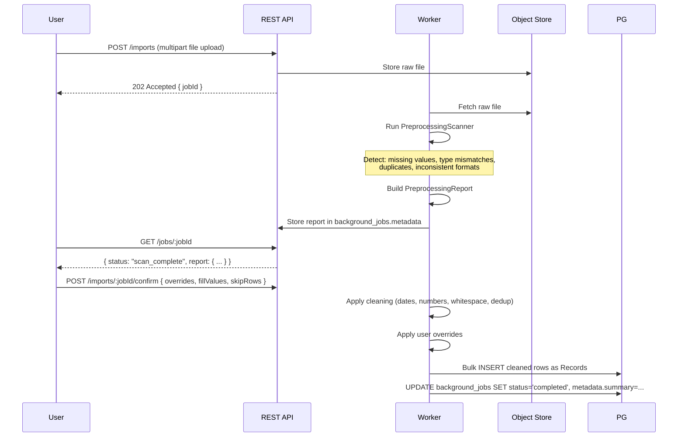
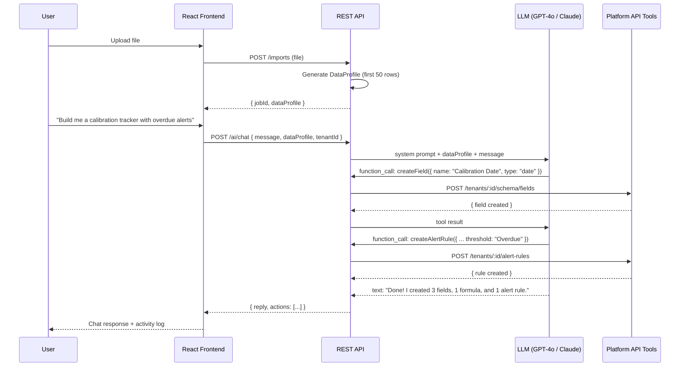
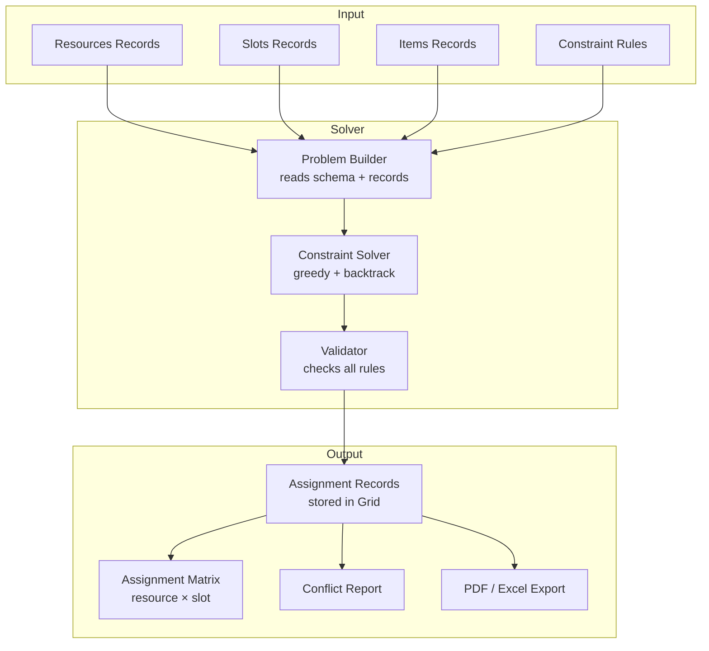

# Design Document

## Universal Dynamic Data & Calibration Platform

---

## Overview

The Universal Dynamic Data & Calibration Platform is a cloud-native, multi-tenant SaaS application for industrial and manufacturing companies. It replaces static spreadsheets and rigid legacy software with a no-code, configurable data management platform.

The system is built around five core capabilities:
- **Dynamic Schema Engine** — Admins define and evolve their data structure at runtime without migrations
- **Formula Engine** — Derived fields are computed automatically from user-defined rules
- **Importer/Exporter** — Excel/CSV round-trip data migration with column mapping
- **Alert & Notification System** — Scheduled and manual compliance alerting via email
- **Live Grid & Dashboard** — Real-time, filterable data views with inline editing

The architecture follows a layered approach: a React SPA frontend communicates with a Node.js/TypeScript REST API, backed by PostgreSQL for relational data and Redis for caching and pub/sub. All tenant data is isolated at the query level via a `tenant_id` column on every table, enforced by a Row-Level Security (RLS) policy in PostgreSQL. Real-time dashboard updates are delivered via Server-Sent Events (SSE). Heavy background work (exports, imports, notifications) is handled asynchronously via BullMQ job queues, keeping HTTP threads free.

---

## Architecture

### High-Level Architecture



### Request Flow



### Technology Choices

| Layer | Technology | Rationale |
|---|---|---|
| Frontend | React + TypeScript + TanStack Table + TanStack Query | Virtualized grid for 50k rows, strong typing; TanStack Query manages server state, cache, and OCC version tokens |
| API | Node.js + Express + TypeScript | Unified language stack, rich ecosystem |
| Real-Time | Server-Sent Events (SSE) | Lightweight one-way push for dashboard updates; no WebSocket overhead |
| Database | PostgreSQL 15+ | RLS for tenant isolation, JSONB for dynamic fields, partitioned audit log |
| Connection Pooler | PgBouncer | Prevents connection exhaustion under 100+ concurrent users |
| Cache / Pub-Sub | Redis | Dashboard pub/sub, session store, BullMQ job queues |
| File Storage | S3-compatible object store (AES-256 at rest) | Scalable upload/export storage |
| Auth | Passport.js + passport-saml + passport-oauth2 | SSO integration |
| Email | Nodemailer + SMTP / SES | Notification delivery with retry |
| Background Jobs | BullMQ (Redis-backed) | Notification daemon, import/export jobs, purge jobs |
| Export | ExcelJS + PDFKit | xlsx and PDF generation |
| Import | ExcelJS + csv-parse | xlsx and CSV parsing |
| Secrets | AWS Secrets Manager / HashiCorp Vault | DB credentials, IdP certs, API signing keys |

---

## Components and Interfaces

### Component Map



### Key REST API Endpoints

```
POST   /auth/login
POST   /auth/sso/saml
POST   /auth/sso/oauth2/callback
POST   /auth/logout

GET    /tenants/:tenantId/schema
POST   /tenants/:tenantId/schema/fields
PATCH  /tenants/:tenantId/schema/fields/:fieldId
DELETE /tenants/:tenantId/schema/fields/:fieldId

# Paginated, filterable, sortable records endpoint
# Query params: limit, cursor, sort_by (e.g. status:desc,name:asc), filter[<fieldId>]=<value>
# Example: GET /tenants/:tenantId/records?limit=100&cursor=xyz&sort_by=status:desc&filter[status]=danger
GET    /tenants/:tenantId/records
POST   /tenants/:tenantId/records
PATCH  /tenants/:tenantId/records/:recordId
DELETE /tenants/:tenantId/records/:recordId
POST   /tenants/:tenantId/records/bulk-update
POST   /tenants/:tenantId/records/bulk-delete

GET    /tenants/:tenantId/formulas
POST   /tenants/:tenantId/formulas
PATCH  /tenants/:tenantId/formulas/:formulaId
DELETE /tenants/:tenantId/formulas/:formulaId

GET    /tenants/:tenantId/alert-rules
POST   /tenants/:tenantId/alert-rules
PATCH  /tenants/:tenantId/alert-rules/:ruleId
DELETE /tenants/:tenantId/alert-rules/:ruleId
POST   /tenants/:tenantId/alert-rules/:ruleId/trigger

GET    /tenants/:tenantId/audit-log

# Async import/export — returns a job ID immediately; client polls for status
POST   /tenants/:tenantId/imports              # triggers import job, returns { jobId }
GET    /tenants/:tenantId/jobs/:jobId          # returns { status, progress_percent, result_url }
POST   /tenants/:tenantId/exports              # triggers export job, returns { jobId }

# Server-Sent Events stream for real-time dashboard updates
GET    /tenants/:tenantId/events/stream        # SSE: emits dashboard_update events

GET    /tenants/:tenantId/api-keys
POST   /tenants/:tenantId/api-keys
DELETE /tenants/:tenantId/api-keys/:keyId
POST   /tenants/:tenantId/api-keys/:keyId/rotate
```

### Middleware Stack

```
Request
  → RateLimiter
  → AuthMiddleware (JWT decode + tenant_id extraction)
  → TenantIsolationMiddleware (validates resource belongs to session tenant)
  → RBACMiddleware (role permission check)
  → RouteHandler
  → AuditMiddleware (writes audit log on mutating operations)
```

---

## Data Models

### Core Tables

#### `tenants`
```sql
CREATE TABLE tenants (
  id            UUID PRIMARY KEY DEFAULT gen_random_uuid(),
  name          TEXT NOT NULL,
  slug          TEXT UNIQUE NOT NULL,
  sso_config    JSONB,           -- SAML/OAuth config per tenant
  created_at    TIMESTAMPTZ NOT NULL DEFAULT now(),
  deleted_at    TIMESTAMPTZ
);
```

#### `users`
```sql
CREATE TABLE users (
  id            UUID PRIMARY KEY DEFAULT gen_random_uuid(),
  tenant_id     UUID NOT NULL REFERENCES tenants(id),
  email         TEXT NOT NULL,
  password_hash TEXT,            -- NULL for SSO-only users
  salt          TEXT,
  role          TEXT NOT NULL CHECK (role IN ('admin', 'manager', 'operator')),
  is_active     BOOLEAN NOT NULL DEFAULT true,
  failed_login_attempts INT NOT NULL DEFAULT 0,
  created_at    TIMESTAMPTZ NOT NULL DEFAULT now(),
  UNIQUE (tenant_id, email)
);
```

#### `dynamic_fields` (Schema)
```sql
CREATE TABLE dynamic_fields (
  id              UUID PRIMARY KEY DEFAULT gen_random_uuid(),
  tenant_id       UUID NOT NULL REFERENCES tenants(id),
  name            TEXT NOT NULL,
  field_type      TEXT NOT NULL CHECK (field_type IN ('text','integer','float','date','status')),
  dropdown_values TEXT[],        -- for status fields: ['Safe','Warning','Danger']
  constraints     JSONB,         -- {min, max, maxLength, dateDirection}
  display_order   INT NOT NULL DEFAULT 0,
  is_deleted      BOOLEAN NOT NULL DEFAULT false,
  deleted_at      TIMESTAMPTZ,
  created_at      TIMESTAMPTZ NOT NULL DEFAULT now(),
  UNIQUE (tenant_id, name) WHERE is_deleted = false
);
```

#### `records`
```sql
CREATE TABLE records (
  id          UUID PRIMARY KEY DEFAULT gen_random_uuid(),
  tenant_id   UUID NOT NULL REFERENCES tenants(id),
  data        JSONB NOT NULL DEFAULT '{}',  -- {field_id: value, ...}
  version     INT NOT NULL DEFAULT 1,       -- optimistic concurrency token
  is_deleted  BOOLEAN NOT NULL DEFAULT false,
  deleted_at  TIMESTAMPTZ,
  created_at  TIMESTAMPTZ NOT NULL DEFAULT now(),
  updated_at  TIMESTAMPTZ NOT NULL DEFAULT now()
);

-- RLS policy (applied to ALL tenant-scoped tables — see note below)
ALTER TABLE records ENABLE ROW LEVEL SECURITY;
CREATE POLICY tenant_isolation ON records
  USING (tenant_id = current_setting('app.current_tenant_id')::UUID);
```

> **RLS Coverage**: Row-Level Security is enabled on every tenant-scoped table — `records`, `dynamic_fields`, `formulas`, `alert_rules`, `audit_log`, `api_keys`, `notification_log`, and `background_jobs`. This prevents cross-tenant data leaks even from accidental JOINs. The API sets `SET LOCAL app.current_tenant_id = '<id>'` at the start of every transaction.

#### `formulas`
```sql
CREATE TABLE formulas (
  id              UUID PRIMARY KEY DEFAULT gen_random_uuid(),
  tenant_id       UUID NOT NULL REFERENCES tenants(id),
  name            TEXT NOT NULL,
  target_field_id UUID NOT NULL REFERENCES dynamic_fields(id),
  expression      TEXT NOT NULL,   -- raw formula string
  ast             JSONB NOT NULL,  -- parsed AST for evaluation
  referenced_field_ids UUID[],
  is_active       BOOLEAN NOT NULL DEFAULT true,
  has_error       BOOLEAN NOT NULL DEFAULT false,
  created_at      TIMESTAMPTZ NOT NULL DEFAULT now(),
  updated_at      TIMESTAMPTZ NOT NULL DEFAULT now()
);
```

#### `alert_rules`
```sql
CREATE TABLE alert_rules (
  id              UUID PRIMARY KEY DEFAULT gen_random_uuid(),
  tenant_id       UUID NOT NULL REFERENCES tenants(id),
  name            TEXT NOT NULL,
  target_field_id UUID NOT NULL REFERENCES dynamic_fields(id),
  operator        TEXT NOT NULL CHECK (operator IN ('eq','neq','lt','gt','lte','gte')),
  threshold       TEXT NOT NULL,   -- stored as text, cast at evaluation time
  recipients      TEXT[] NOT NULL,
  is_active       BOOLEAN NOT NULL DEFAULT true,
  last_evaluated  TIMESTAMPTZ,
  created_at      TIMESTAMPTZ NOT NULL DEFAULT now()
);
```

#### `audit_log`
```sql
CREATE TABLE audit_log (
  id            BIGSERIAL PRIMARY KEY,
  tenant_id     UUID NOT NULL,
  actor_user_id UUID NOT NULL,
  record_id     UUID,
  entity_type   TEXT NOT NULL,  -- 'record' | 'schema' | 'formula' | 'alert_rule' | 'notification'
  action        TEXT NOT NULL,  -- 'create' | 'update' | 'delete' | 'alert_triggered'
  field_name    TEXT,
  old_value     TEXT,
  new_value     TEXT,
  metadata      JSONB,
  created_at    TIMESTAMPTZ NOT NULL DEFAULT now()
) PARTITION BY RANGE (created_at);
-- Partitioned by month for query performance at scale
-- Append-only: no UPDATE or DELETE permissions granted on this table
```

#### `api_keys`
```sql
CREATE TABLE api_keys (
  id          UUID PRIMARY KEY DEFAULT gen_random_uuid(),
  tenant_id   UUID NOT NULL REFERENCES tenants(id),
  key_hash    TEXT NOT NULL UNIQUE,  -- hashed; raw key shown once at creation
  name        TEXT NOT NULL,
  role        TEXT NOT NULL CHECK (role IN ('admin', 'manager', 'operator')),
  is_active   BOOLEAN NOT NULL DEFAULT true,
  last_used   TIMESTAMPTZ,
  created_at  TIMESTAMPTZ NOT NULL DEFAULT now(),
  revoked_at  TIMESTAMPTZ
);
```

#### `notification_log`
```sql
CREATE TABLE notification_log (
  id            UUID PRIMARY KEY DEFAULT gen_random_uuid(),
  tenant_id     UUID NOT NULL,
  alert_rule_id UUID NOT NULL REFERENCES alert_rules(id),
  status        TEXT NOT NULL CHECK (status IN ('pending','sent','failed')),
  attempt_count INT NOT NULL DEFAULT 0,
  last_attempt  TIMESTAMPTZ,
  error_message TEXT,
  created_at    TIMESTAMPTZ NOT NULL DEFAULT now()
);
```

#### `background_jobs`
```sql
CREATE TABLE background_jobs (
  id              UUID PRIMARY KEY DEFAULT gen_random_uuid(),
  tenant_id       UUID NOT NULL REFERENCES tenants(id),
  type            TEXT NOT NULL CHECK (type IN ('import','export')),
  status          TEXT NOT NULL CHECK (status IN ('queued','processing','completed','failed'))
                  DEFAULT 'queued',
  progress_percent INT NOT NULL DEFAULT 0,
  result_url      TEXT,          -- S3 pre-signed URL once job completes
  error_message   TEXT,
  created_by      UUID NOT NULL REFERENCES users(id),
  created_at      TIMESTAMPTZ NOT NULL DEFAULT now(),
  updated_at      TIMESTAMPTZ NOT NULL DEFAULT now()
);
```

### Key Indexes

```sql
-- Tenant isolation + common query patterns
CREATE INDEX idx_records_tenant_id ON records(tenant_id) WHERE is_deleted = false;
CREATE INDEX idx_records_data_gin ON records USING GIN(data);  -- JSONB key existence + text search
CREATE INDEX idx_audit_log_tenant_date ON audit_log(tenant_id, created_at DESC);
CREATE INDEX idx_audit_log_record ON audit_log(record_id, created_at DESC);
CREATE INDEX idx_dynamic_fields_tenant ON dynamic_fields(tenant_id) WHERE is_deleted = false;
CREATE INDEX idx_background_jobs_tenant ON background_jobs(tenant_id, created_at DESC);
```

#### JSONB Functional Index Strategy for Sorting & Range Queries

GIN indexes are efficient for key-existence and full-text search but perform poorly on range queries (`>`, `<`, `BETWEEN`) and ORDER BY over JSONB values. For dynamic fields that are frequently sorted or range-filtered, the API creates a **B-tree functional index** on demand when a field is marked as a sort/filter target:

```sql
-- Example: Admin marks the 'capacity' (numeric) field as sortable
-- API executes at schema configuration time:
CREATE INDEX CONCURRENTLY idx_records_field_capacity
  ON records ((cast(data->>'<field_id>' AS numeric)))
  WHERE is_deleted = false AND tenant_id = '<tenant_id>';

-- Example: date field for range filtering
CREATE INDEX CONCURRENTLY idx_records_field_calibration_date
  ON records ((cast(data->>'<field_id>' AS date)))
  WHERE is_deleted = false AND tenant_id = '<tenant_id>';
```

These indexes are created `CONCURRENTLY` to avoid table locks. The `SchemaService` tracks which fields have functional indexes and drops them when a field is deleted or its type changes.

### Formula AST Structure

Formulas are parsed into a typed AST for safe evaluation:

```typescript
type ASTNode =
  | { type: 'number'; value: number }
  | { type: 'string'; value: string }
  | { type: 'field_ref'; fieldId: string }
  | { type: 'binary_op'; op: '+' | '-' | '*' | '/'; left: ASTNode; right: ASTNode }
  | { type: 'date_add'; date: ASTNode; days: ASTNode }
  | { type: 'if'; condition: ASTNode; then: ASTNode; else: ASTNode }
  | { type: 'compare'; op: '==' | '!=' | '<' | '>' | '<=' | '>='; left: ASTNode; right: ASTNode };
```

### Import/Export Data Flow

Imports and exports are handled as **async background jobs** via BullMQ to avoid blocking HTTP threads.




### Smart Data Preprocessing Pipeline

Before the column mapping step, the import worker runs a **preprocessing scan** on the raw file. This is a pure analysis pass — no data is written to the database yet.



#### PreprocessingScanner — Detection Rules

| Issue | Detection Logic |
|---|---|
| Missing value | Cell is empty, null, or whitespace-only |
| Type mismatch | Cell value cannot be coerced to the inferred column type |
| Duplicate row | All field values identical to another row in the file |
| Inconsistent date format | Multiple date patterns detected in same column (e.g. `DD/MM/YYYY` and `MM-DD-YYYY`) |
| Inconsistent number format | Mixed decimal separators (`.` vs `,`) or thousands separators in same column |

#### Auto-Cleaning Operations (applied on confirm)

| Operation | Rule |
|---|---|
| Date normalization | Parse any detected date format → ISO 8601 (`YYYY-MM-DD`) |
| Number normalization | Remove thousands separators, standardize decimal to `.` |
| Whitespace trim | `value.trim()` on all text values |
| Duplicate removal | Keep first occurrence, remove subsequent exact duplicates |

#### PreprocessingReport Shape

```typescript
interface PreprocessingReport {
  totalRows: number;
  issuesByCategory: {
    missingValues: number;
    typeMismatches: number;
    duplicates: number;
    inconsistentFormats: number;
  };
  cleaningActions: Array<{
    rowIndex: number;
    column: string;
    originalValue: string;
    correctedValue: string;
    action: 'date_normalized' | 'number_normalized' | 'whitespace_trimmed' | 'duplicate_removed';
  }>;
  flaggedRows: Array<{
    rowIndex: number;
    column: string;
    issue: string;
    requiresUserAction: boolean; // true for missing required fields
  }>;
}
```

New API endpoints for the preprocessing flow:
```
POST /tenants/:tenantId/imports                    — upload file, trigger scan, return jobId
GET  /tenants/:tenantId/jobs/:jobId                — poll status; returns report when scan_complete
POST /tenants/:tenantId/imports/:jobId/confirm     — confirm import with optional overrides
```

---

## AI Orchestration Agent

### Architecture

The AI agent is an **agentic orchestrator** — it reads the shape of the user's data, listens to natural language instructions, and autonomously calls the platform's own REST API to build the configuration. It never reads all 50,000 rows; it works from a lightweight data profile.



### Data Profile

Generated from the first 50 rows of the uploaded file. Sent as context to the LLM — never the full dataset.

```typescript
interface DataProfile {
  filename: string;
  rowCount: number;          // total rows in file
  columns: Array<{
    name: string;
    inferredType: string;    // text | integer | float | date | status
    sampleValues: string[];  // up to 5 unique non-empty values
    missingCount: number;
    uniqueCount: number;
  }>;
}
```

### LLM Function Definitions (Tool Calling)

The LLM is given these tools, which map directly to the platform's REST API:

| Tool | Maps to |
|---|---|
| `create_field(name, type, constraints?)` | `POST /tenants/:id/schema/fields` |
| `create_formula(name, target_field, expression)` | `POST /tenants/:id/formulas` |
| `create_alert_rule(name, field, operator, threshold, recipients)` | `POST /tenants/:id/alert-rules` |
| `list_fields()` | `GET /tenants/:id/schema` |
| `list_formulas()` | `GET /tenants/:id/formulas` |
| `list_alert_rules()` | `GET /tenants/:id/alert-rules` |
| `delete_field(fieldId)` | `DELETE /tenants/:id/schema/fields/:fieldId` |
| `delete_formula(formulaId)` | `DELETE /tenants/:id/formulas/:formulaId` |
| `delete_alert_rule(ruleId)` | `DELETE /tenants/:id/alert-rules/:ruleId` |

### System Prompt Strategy

```
You are an expert industrial data system architect embedded in the UDCP platform.
The user has uploaded a file. Here is the data profile:
<DATA_PROFILE>

Your job is to help the user build their data management system by calling the available tools.
Rules:
- Always call list_fields() first to see what already exists before creating duplicates.
- Use field IDs (not names) when referencing fields in formulas and alert rules.
- Formula syntax: use [fieldId] to reference fields. Supports +, -, *, /, IF(), DATE_ADD().
- When you create something, briefly explain what you did and why.
- If the user's request is ambiguous, ask one clarifying question before acting.
- Never access data from other tenants.
```

### Technology

- LLM: OpenAI `gpt-4o` (primary) or Anthropic `claude-3-5-sonnet` (fallback), configured via `OPENAI_API_KEY` / `ANTHROPIC_API_KEY` in Secrets Manager
- SDK: `openai` npm package with streaming support
- Conversation history stored in Redis (TTL: 24h) keyed by `ai:session:<tenantId>:<sessionId>`
- Each tool call is executed server-side using the same authenticated API client as the user (same `tenantId`, same RBAC)

---

## Universal Constraint-Based Assignment Engine

### Core Concept

The engine is **domain-agnostic**. It does not know about "exams" or "faculty" or "rooms". It only knows about three abstract concepts that map to any real-world assignment problem:

| Abstract Concept | Exam Example | Shift Planning Example | Delivery Example |
|---|---|---|---|
| **Resource** | Faculty member | Employee | Driver/Vehicle |
| **Slot** | Date + Time slot | Shift + Date | Route + Time window |
| **Item** | Student (roll range) | Task | Package |

All three are just Records in the Dynamic Schema Engine. The constraint rules are just formulas and alert rules. The solver reads them generically.

### Architecture



### Constraint Rule Types

Defined by the user through the Constraint Rule Builder UI — no code required:

```typescript
type ConstraintType =
  | 'min_assignments'    // resource must have >= N assignments
  | 'max_assignments'    // resource must have <= N assignments
  | 'no_simultaneous'    // resource cannot be in two slots at the same time
  | 'group_together'     // items matching a filter go to the same slot/resource
  | 'capacity_limit'     // slot cannot exceed its capacity field value
  | 'priority_order'     // fill high-priority slots before low-priority ones
  | 'exclusion'          // resource X cannot be in slot Y (blacklist)
  | 'formula'            // any custom formula-based rule
```

### Solver Algorithm

Uses a **greedy first-fit with backtracking** approach — fast enough for real-world sizes (hundreds of resources, thousands of items) within the 30-second limit:

```
1. Sort slots by priority (descending) and capacity (descending)
2. Sort resources by availability score = (max_limit - current_assignments) / max_limit
3. For each slot:
   a. Calculate required resource count from slot capacity
   b. Filter eligible resources (not at max, not simultaneous conflict)
   c. Assign top N eligible resources (sorted by availability score)
   d. If not enough eligible resources → add to conflict report
4. Distribute items to slots based on grouping rules (roll ranges, categories, etc.)
5. Validate all constraints → if violations found, backtrack and retry
6. Return assignments + conflict report
```

### Data Model — New Tables

```sql
-- Constraint rules for the solver
CREATE TABLE constraint_rules (
  id          UUID PRIMARY KEY DEFAULT gen_random_uuid(),
  tenant_id   UUID NOT NULL REFERENCES tenants(id),
  name        TEXT NOT NULL,
  type        TEXT NOT NULL,  -- ConstraintType enum
  config      JSONB NOT NULL, -- { field, operator, value, target_field, etc. }
  is_active   BOOLEAN DEFAULT true,
  created_at  TIMESTAMPTZ DEFAULT now()
);

-- Generated assignments (stored as regular records for Grid/export)
-- Uses the existing records table with a special schema
-- assignment_schema fields: resource_id, slot_id, item_range, assigned_at, is_override
```

### API Endpoints

```
POST /tenants/:tenantId/solver/run
  Body: { resourceSchemaId, slotSchemaId, itemSchemaId, constraintRuleIds[] }
  Returns: { jobId }  — async, polls via GET /jobs/:jobId

GET  /tenants/:tenantId/solver/assignments
  Returns: assignment matrix as records

POST /tenants/:tenantId/solver/assignments/:id/override
  Body: { resourceId, slotId }  — manual override, re-validates constraints

GET  /tenants/:tenantId/solver/conflicts
  Returns: list of unresolvable constraint violations

POST /tenants/:tenantId/solver/export
  Body: { format: 'xlsx' | 'pdf', templateId? }
  Returns: file download
```

### Template Engine for Export

The output document format is user-configurable — not hardcoded to any department's circular format:

```typescript
interface ExportTemplate {
  id: string;
  name: string;
  sections: Array<{
    type: 'matrix' | 'list' | 'summary' | 'header' | 'footer';
    title: string;
    fields: string[];   // which assignment fields to include
    groupBy?: string;   // group rows by this field
    sortBy?: string;
  }>;
}
```

Users can define their own template (e.g., "Department of CSE circular format") and reuse it across exam cycles.

---

## AI Orchestration Agent

### Connection Pooling

Node.js opens a new PostgreSQL connection per request by default, which exhausts the database's `max_connections` limit under load. **PgBouncer** sits between the API/workers and PostgreSQL in transaction-pooling mode, multiplexing hundreds of application connections onto a small pool of actual database connections (target: 20–50 connections to PG per node).

```
API Nodes (N × 10 connections) → PgBouncer → PostgreSQL (max 50 connections)
```

### Secrets Management

All sensitive credentials are stored in **AWS Secrets Manager** (or HashiCorp Vault for self-hosted deployments). No secrets are stored in environment variables or source code.

| Secret | Storage |
|---|---|
| PostgreSQL credentials | Secrets Manager — rotated every 30 days |
| Redis auth token | Secrets Manager |
| SAML IdP certificates | Secrets Manager |
| S3 access keys | IAM instance roles (no static keys) |
| API signing key (JWT) | Secrets Manager |
| SMTP credentials | Secrets Manager |

The API fetches secrets at startup and caches them in memory. A background process refreshes secrets before expiry.

### Data Encryption

| Layer | Standard |
|---|---|
| Data in transit (API ↔ SPA, API ↔ IdP) | TLS 1.3 enforced; TLS 1.0/1.1 disabled |
| PostgreSQL volumes | AES-256 encryption at rest (managed disk encryption) |
| Redis cluster | AES-256 encryption at rest + TLS in transit |
| S3 buckets (uploads, exports) | AES-256 SSE-S3 or SSE-KMS |
| Backups | AES-256 encrypted before upload to backup storage |

### Real-Time Dashboard (SSE)

The dashboard subscribes to `GET /tenants/:tenantId/events/stream`, which holds an open HTTP connection and pushes `text/event-stream` events. When a record update changes a status-category count, the API publishes a `dashboard_update` message to a Redis channel. The SSE handler subscribes to that channel and forwards the event to all connected clients for that tenant.

```
Record update → API → Redis PUBLISH tenant:<id>:dashboard → SSE handler → Client
```

This replaces polling and delivers updates within seconds rather than the 30-second polling ceiling.

---

*A property is a characteristic or behavior that should hold true across all valid executions of a system — essentially, a formal statement about what the system should do. Properties serve as the bridge between human-readable specifications and machine-verifiable correctness guarantees.*

Property-based testing is applied here using **fast-check** (TypeScript). Each property is run with a minimum of 100 iterations. Properties are tagged with the format: `Feature: universal-data-calibration-platform, Property N: <title>`.

---

### Property 1: Tenant Data Isolation

*For any* two distinct tenants A and B, and any set of records belonging to tenant A, executing any query authenticated as tenant B SHALL return zero records belonging to tenant A.

**Validates: Requirements 1.1, 1.2, 1.3**

---

### Property 2: New Tenant Onboarding Does Not Affect Existing Tenants

*For any* existing tenant with a known set of records and schema configuration, onboarding a new tenant SHALL leave the existing tenant's records and schema configuration identical to their pre-onboarding state.

**Validates: Requirements 1.4**

---

### Property 3: Password Hashing Uniqueness

*For any* two users created with any passwords (including identical passwords), the stored password hashes SHALL differ from the plaintext passwords, and the per-user salts SHALL be unique across all users.

**Validates: Requirements 2.1**

---

### Property 4: Invalid Credential Response Indistinguishability

*For any* login attempt with an invalid email, and *for any* login attempt with a valid email but invalid password, the error response message SHALL be identical — revealing neither which credential was incorrect nor whether the email exists.

**Validates: Requirements 2.3**

---

### Property 5: RBAC Enforcement

*For any* user with a given role (admin, manager, operator) and *for any* action in the system, the system SHALL permit the action if and only if the action is within that role's defined permission set, and SHALL deny it with a permission error otherwise.

**Validates: Requirements 2.4, 2.5**

---

### Property 6: SSO Claim-to-Role Mapping

*For any* set of IdP group claims presented during SSO authentication, the platform SHALL map each claim to exactly the platform role defined in the tenant's SSO configuration, with no claim producing an unmapped or elevated role.

**Validates: Requirements 2.8**

---

### Property 7: Import File Acceptance Boundary

*For any* file, the importer SHALL accept it if and only if it is in `.xlsx` or `.csv` format AND its size is ≤ 50 MB; all other files SHALL be rejected with a descriptive error.

**Validates: Requirements 3.1, 3.3**

---

### Property 8: Import Row Count Accuracy

*For any* valid file containing N rows where K rows have type-coercion errors, the importer SHALL produce exactly (N − K) records and report exactly K skipped rows with reasons.

**Validates: Requirements 3.5, 3.6**

---

### Property 9: Import–Export Round Trip

*For any* valid tabular dataset imported into the platform, exporting the resulting records to `.xlsx` and re-importing the exported file SHALL produce a record set with field values equivalent to the original import.

**Validates: Requirements 3.7, 11.4**

---

### Property 10: Dynamic Field Availability After Addition

*For any* existing set of records within a tenant, adding a new dynamic field to the schema SHALL make that field accessible (with a null/default value) on every existing record without requiring downtime or data migration.

**Validates: Requirements 4.2**

---

### Property 11: Field Rename Consistency

*For any* dynamic field referenced by any combination of records, formulas, and alert rules, renaming that field SHALL update all references consistently so that no formula or alert rule retains the old field name.

**Validates: Requirements 4.3**

---

### Property 12: Field Deletion Invalidates Dependents

*For any* dynamic field that is referenced by one or more formulas or alert rules, deleting that field SHALL mark all dependent formulas and alert rules as invalid/error state, with no dependent remaining in an active/valid state.

**Validates: Requirements 4.4**

---

### Property 13: Dynamic Field Name Uniqueness

*For any* tenant schema, attempting to create a dynamic field with a name that already exists in that tenant's active schema SHALL be rejected, while the same name in a different tenant's schema SHALL be accepted.

**Validates: Requirements 4.5**

---

### Property 14: Soft Delete Retention

*For any* record or dynamic field that is soft-deleted, the item SHALL be marked as inactive (is_deleted = true) but its data SHALL remain present and retrievable in the database, and SHALL NOT appear in normal (non-archive) queries.

**Validates: Requirements 4.7, 8.8**

---

### Property 15: Soft Delete Restore Round-Trip

*For any* soft-deleted record or dynamic field deleted within the last 30 days, restoring it SHALL return the item to active status with all original data intact, making it appear in normal queries as if it had never been deleted.

**Validates: Requirements 4.8, 8.9**

---

### Property 16: Validation Constraint Enforcement

*For any* dynamic field with a defined validation constraint (min/max for numeric, length limit for text, date direction for date), attempting to save a record value that violates that constraint SHALL be rejected with a descriptive error identifying the field and the violated constraint.

**Validates: Requirements 4.11**

---

### Property 17: Formula Syntax Round-Trip

*For any* valid formula expression string, parsing it to an AST and then serializing the AST back to a canonical string SHALL produce an expression that, when parsed again, yields an AST equivalent to the first parse result.

**Validates: Requirements 5.2**

---

### Property 18: Formula Recalculation on Field Update

*For any* record and any formula whose referenced fields include a field updated on that record, the formula's derived field value SHALL be recalculated and updated on the record as part of the same operation that updated the referenced field.

**Validates: Requirements 5.3**

---

### Property 19: Formula Inverse Consistency

*For any* record with a formula-derived field, applying an input change to a referenced field and then reversing that change SHALL restore the derived field to its original computed value.

**Validates: Requirements 5.6**

---

### Property 20: Alert Notification Completeness

*For any* active alert rule and *for any* set of records where the rule's condition is met, the notification daemon SHALL dispatch an email notification to every configured recipient address, listing all records that triggered the condition.

**Validates: Requirements 6.3**

---

### Property 21: Email Retry with Exponential Backoff

*For any* email delivery attempt that fails, the notification daemon SHALL retry delivery up to exactly 3 times, with each retry interval at least double the previous interval (exponential backoff), before marking the notification as failed.

**Validates: Requirements 6.4**

---

### Property 22: Alert Rule State Change Isolation

*For any* set of alert rules, activating, deactivating, or deleting one rule SHALL leave all other rules' active/inactive state and configuration unchanged.

**Validates: Requirements 6.7**

---

### Property 23: Audit Log Completeness

*For any* mutating operation (record create/update/delete, schema field add/rename/delete, formula create/update/delete, alert rule trigger), the platform SHALL write an audit log entry containing: actor user ID, tenant ID, affected entity ID, entity type, action, field name (where applicable), old value, new value, and UTC timestamp — with no required field missing.

**Validates: Requirements 7.1, 7.2, 6.6**

---

### Property 24: Audit Log Immutability

*For any* audit log entry and *for any* user role (including admin), any attempt to modify or delete that audit log entry SHALL be rejected by the system.

**Validates: Requirements 7.3**

---

### Property 25: Filter Correctness

*For any* set of records and *for any* filter condition applied to any dynamic field, every record returned by the filter SHALL satisfy the filter predicate, and no record satisfying the predicate SHALL be omitted from the results.

**Validates: Requirements 8.2, 8.3**

---

### Property 26: Multi-Column Sort Correctness

*For any* set of records and *for any* multi-column sort specification, the returned record sequence SHALL be ordered such that for every adjacent pair of records, the first record is less than or equal to the second record according to the sort specification's column priority and direction.

**Validates: Requirements 8.4**

---

### Property 27: Inline Edit Atomicity

*For any* inline cell edit operation, either all four effects (validation, save, formula recalculation, audit log write) SHALL complete successfully, or none of them SHALL be applied — leaving the record in its pre-edit state.

**Validates: Requirements 8.5**

---

### Property 28: Optimistic Concurrency Control

*For any* record with version token V, if two concurrent update requests both carry version token V, exactly one SHALL succeed and the other SHALL be rejected with a concurrency error requiring the client to refresh before retrying.

**Validates: Requirements 8.7**

---

### Property 29: Bulk Update Atomicity

*For any* bulk update operation targeting N records, either all N records SHALL be updated or none SHALL be updated — no partial application of the bulk update SHALL be observable.

**Validates: Requirements 8.11**

---

### Property 30: Bulk Update Audit Log Completeness

*For any* bulk update operation that successfully updates N records, the platform SHALL write exactly N individual audit log entries — one per affected record — with no record omitted from the audit trail.

**Validates: Requirements 8.12**

---

### Property 31: Dashboard Count Accuracy

*For any* set of records with known status distributions, the dashboard widget counts SHALL equal the exact count of active (non-deleted) records in each status category, with no over-counting or under-counting.

**Validates: Requirements 9.1**

---

### Property 32: Configurator Change Dependency Warning

*For any* configuration change (field rename, field delete, type change) that would invalidate one or more existing formulas or alert rules, the configurator SHALL present a warning listing all affected formulas and alert rules before applying the change, and SHALL NOT apply the change without explicit admin confirmation.

**Validates: Requirements 10.4**

---

### Property 33: Export File Completeness

*For any* grid state with a given set of visible columns, active filters, tenant name, and export timestamp, the exported file SHALL contain all visible columns, the filter criteria as a header annotation, the tenant name, and the export timestamp — with no required element missing.

**Validates: Requirements 11.3**

---

### Property 34: API Key Rejection

*For any* API request made with an invalid, expired, or revoked API key, the platform SHALL return a 401 Unauthorized response and write a log entry recording the attempt — regardless of the requested operation or endpoint.

**Validates: Requirements 14.1, 14.3**

---

## Error Handling

### Tenant Isolation Violations
- Any request referencing a resource from a different tenant returns `403 Forbidden`
- The violation is logged to the audit log with actor, tenant, and target resource
- No data from the target tenant is included in the response

### Authentication Errors
- Invalid credentials: `401 Unauthorized` with a generic message (no field-level disclosure)
- Expired session/token: `401 Unauthorized` with a prompt to re-authenticate
- Failed login attempts are tracked; after a configurable threshold, the account is temporarily locked

### Validation Errors
- Field constraint violations: `422 Unprocessable Entity` with a structured error body:
  ```json
  { "field": "calibration_date", "constraint": "past_only", "message": "Date must be in the past" }
  ```
- Formula syntax errors: `422` with the parser error message and position
- Duplicate field names: `409 Conflict`

### Import Errors
- Malformed/unsupported file: `400 Bad Request` with a descriptive message
- Row-level type coercion failures: logged per-row, import continues; summary returned in response
- File size exceeded: `413 Payload Too Large`

### Formula Runtime Errors
- Division by zero: derived field set to `null` with `error_state: "division_by_zero"`
- Type mismatch: derived field set to `null` with `error_state: "type_mismatch"`
- Error state is surfaced in the Grid with a visual indicator on the affected cell

### Concurrency Errors
- Optimistic concurrency conflict: `409 Conflict` with message prompting the user to refresh
- The response includes the current record version so the client can reload

### Notification Failures
- Email delivery failure: retry up to 3 times with exponential backoff (1s, 2s, 4s)
- After 3 failures: notification marked as `failed`, error logged, audit log entry written
- Platform ops team alerted via a separate monitoring channel

### Export/Import Errors
- Export/import job failure: `background_jobs.status` set to `failed`, error message stored; client receives failure on next poll
- Re-import of exported file with schema drift: treated as a new import with the mapper UI
- Job not found or belongs to different tenant: `404 Not Found`

### Database and Infrastructure Errors
- All unhandled database errors are caught, logged with a correlation ID, and returned as `500 Internal Server Error` — no stack traces exposed to clients
- Backup failures trigger an ops alert and a retry within 1 hour

---

## Testing Strategy

### Dual Testing Approach

The testing strategy combines **unit/example-based tests** for specific behaviors and **property-based tests** for universal correctness guarantees.

**Property-Based Testing Library**: `fast-check` (TypeScript)
- Minimum **100 iterations** per property test
- Each property test is tagged: `Feature: universal-data-calibration-platform, Property N: <title>`

### Unit / Example-Based Tests

Focus areas:
- Authentication flows (login, SSO callback, token expiry)
- Role permission matrix (each role × each action)
- Formula editor: arithmetic, date arithmetic, conditional logic examples
- Import: specific file format examples (xlsx, csv, malformed, password-protected)
- Export: xlsx and PDF output format verification
- Soft delete and restore lifecycle
- Purge job (items > 30 days)
- Dashboard widget count rendering
- Configurator UI: formula/alert rule list display
- API key generate/rotate/revoke

### Property-Based Tests

Each of the 34 correctness properties above maps to a single property-based test. Key generators needed:

| Generator | Description |
|---|---|
| `arbTenant()` | Random tenant with UUID, name, slug |
| `arbUser(tenantId, role?)` | Random user for a tenant with optional role |
| `arbDynamicField(tenantId)` | Random field with random type and constraints |
| `arbRecord(tenantId, schema)` | Random record conforming to a schema |
| `arbFormula(schema)` | Random valid formula AST over schema fields |
| `arbAlertRule(schema)` | Random alert rule with random operator and threshold |
| `arbFilterCondition(schema)` | Random filter condition for a schema field |
| `arbSortSpec(schema)` | Random multi-column sort specification |
| `arbBulkUpdate(records, schema)` | Random bulk update targeting a subset of records |

### Integration Tests

- SSO flow with mock SAML/OAuth IdP
- Notification daemon scheduling and email dispatch (mock SMTP)
- Backup integrity verification
- Audit log query performance at 1M entries
- Grid rendering performance at 50k records

### Smoke Tests

- Backup schedule configuration is set to daily
- Backup retention policy is set to 30 days
- Audit log retention policy is set to 7 years
- RLS policies are enabled on all tenant-scoped tables: `records`, `dynamic_fields`, `formulas`, `alert_rules`, `audit_log`, `api_keys`, `notification_log`, `background_jobs`
- PgBouncer is running and proxying all database connections
- All S3 buckets have SSE-AES256 enabled
- TLS 1.3 is enforced on all API endpoints (TLS 1.0/1.1 rejected)
- SSE endpoint emits `dashboard_update` events within 5 seconds of a record status change

### Load Tests

- 50,000 records per tenant: Grid render < 100ms per interaction
- Search/filter on 50,000 records: response < 500ms
- 100 concurrent authenticated users: query response < 500ms
- Export of 10,000 records: file available within 30 seconds
